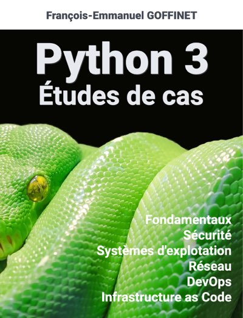

# Introduction

<!-- toc -->

## Présentation

Ce document recense des projets d'apprentissage du langage Python. Date de fabrication : {{ gitbook.time }}

Il recommandé de lire et de s'exercer à partir des documents suivants ainsi que leurs équivalents et supérieurs :

* [Apprendre à programmer en Python 2 et en Python 3](https://inforef.be/swi/python.htm)
* [Programmation Python](https://fr.wikibooks.org/wiki/Programmation_Python)
* [Apprendre le langage de programmation python](http://apprendre-python.com/)
* [Python 3 Module of the Week](https://pymotw.com/3/index.html)
* [Programming Python, 4th Edition, Mark Lutz](https://learning-python.com/about-pp4e.html)
* [Python dans tous ses états](http://www.xavierdupre.fr/app/ensae_teaching_cs/helpsphinx/index.html)

## Page de couverture

[Source de l'image](https://pixabay.com/fr/green-tree-python-python-543243/)

## Code des exemples

Le code des exemples est disponible sur [https://gitlab.com/goffinet/projets-python](https://gitlab.com/goffinet/projets-python)
